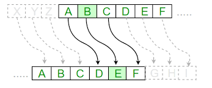

# Ceaser-Cipher

# Ceaser Cipher is a substitution cipher in which each letter is replaced by a letter some fixed number of positions down the alphabet.
# Example: 
    For the word : Game
    Key : 2  # number of place the words has to be moved
    Ceaser Encoded Word : Icog

# Click <a href='Caesar Cipher.ipynb'>Here</a> for the Notebook File.
